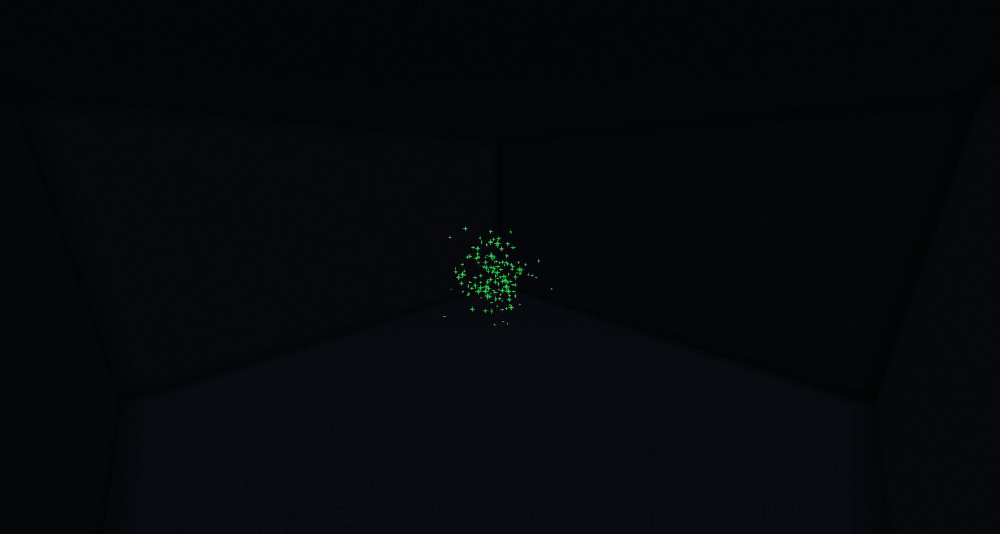

# Particle Visualiser

A simple plugin & a website to visualise particles in a minecraft. 




## Building 

### Plugin
To build the plugin, run `.\gradlew clean reobfJar` (or `./gradlew clean reobfJar` on linux) in the root directory. 
The jar will be in `/build/libs` directory.

### Webapp

To build the webapp, run `npm run build` in the `webapp` (`cd webapp`) directory. 
The built files will be in the `/webapp/build` directory.

## Running 
1. Install the latest paper 1.18.2 
2. Put `ParticleVisualisation-1.0-SNAPSHOT.jar` file in the `plugins` directory of your server.
3. Unzip the `webapp.zip` file in the `plugins/ParticleVisualizer/webapp` directory of your server.
4. Run the server

## Configuration

```yaml
port: 4567 # The port the webapp will run on
```